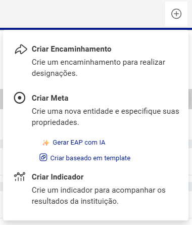
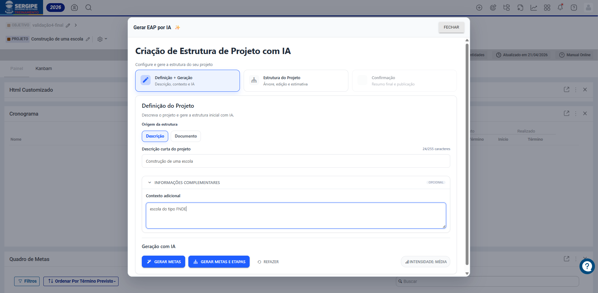
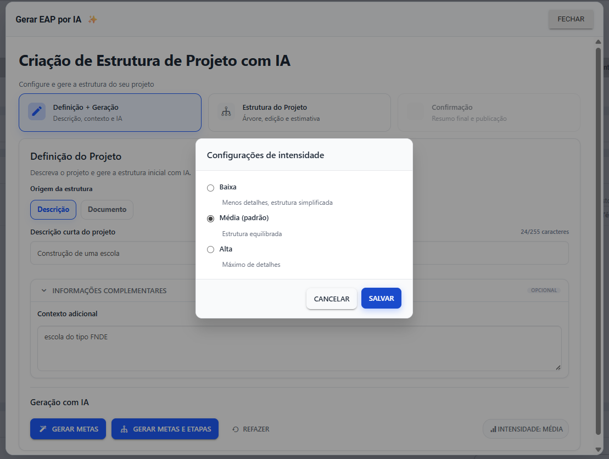
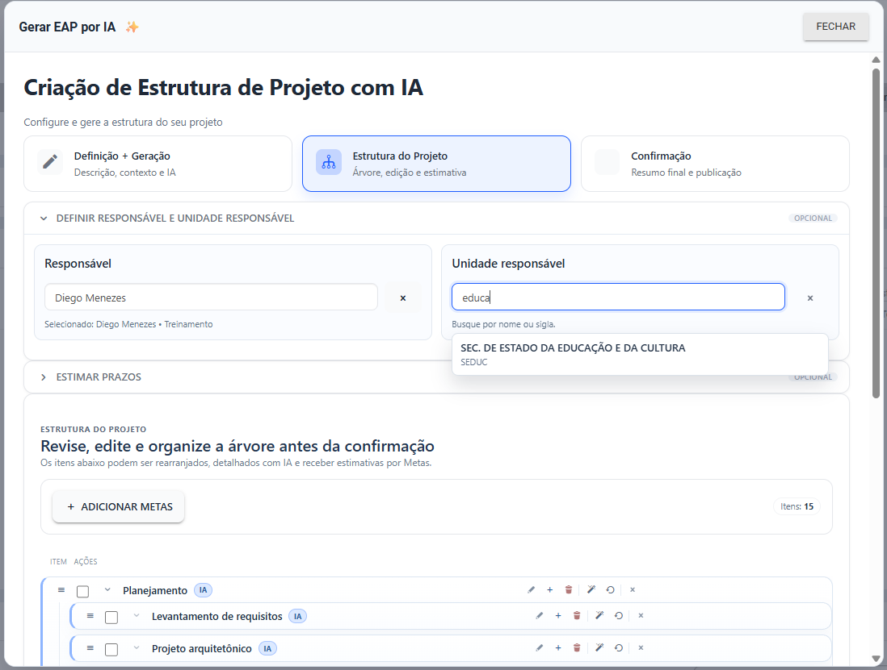
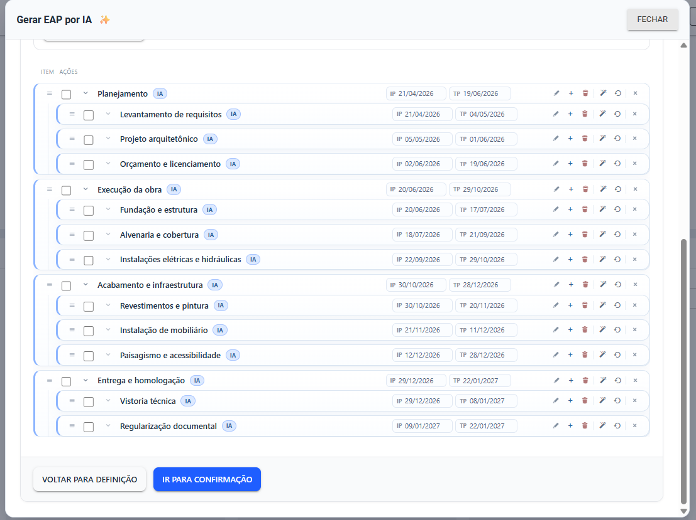
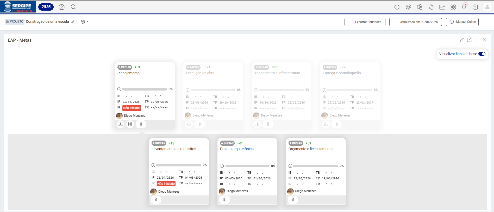

# Gerar EAP com IA

Montar a estrutura de um projeto do zero pode consumir horas de trabalho manual. Com o <strong>Gerar EAP com IA</strong>, você descreve o projeto ou anexa um documento e a inteligência artificial sugere as etapas, atividades e subníveis de forma organizada e pronta para usar. Em minutos, sua equipe tem uma EAP completa, editável e com datas estimadas para trabalhar.

<iframe width="100%" height="480" src="https://www.youtube.com/embed/PxCmfkXxab4" title="Gerar EAP com IA" frameborder="0" allow="accelerometer; autoplay; clipboard-write; encrypted-media; gyroscope; picture-in-picture; web-share" allowfullscreen></iframe>

---

💡 <strong>Disponibilidade:</strong> Esta funcionalidade utiliza inteligência artificial e está disponível conforme a contratação. Nem todos os planos incluem acesso a recursos de IA. Verifique com o administrador se o recurso está habilitado para o seu ambiente. Limites de uso podem ser aplicáveis conforme a configuração da conta.

> ⚠️ **Nomenclatura por ambiente:** Os nomes dos níveis hierárquicos (etapas, tarefas, etc.) variam conforme a configuração do ambiente do cliente. De forma geral, a funcionalidade sempre gera o nível imediatamente inferior ao item atual e o nível subsequente.

---

## Como acessar

1. Navegue até a entidade (Objetivo ou Projeto) onde deseja criar a estrutura.
2. Clique no botão **+** no canto superior direito da tela.
3. Selecione a opção **Criar Etapa** e, em seguida, clique em **Gerar EAP com IA**.

---

## 1. Definição e Geração

O primeiro passo é informar do que se trata o projeto e acionar a geração da estrutura.

### Origem da estrutura

Você pode escolher entre duas formas de entrada:

- **Descrição:** escreva uma descrição curta do projeto (até 255 caracteres). Ideal para projetos simples ou quando a ideia ainda está sendo estruturada.
- **Documento:** envie um arquivo TXT, DOCX, PDF ou XLSX. A IA lê o conteúdo e utiliza as informações para gerar a estrutura.

### Contexto adicional (opcional)

O campo **Contexto adicional** permite fornecer informações complementares que orientam a IA, como o tipo de projeto, a metodologia adotada ou o público envolvido. Quanto mais contexto você der, mais preciso será o resultado.

### Nível de intensidade

Clique em **Intensidade** para ajustar o nível de detalhamento da estrutura gerada:

| Opção | Descrição |
|---|---|
| **Baixa** | Estrutura simplificada, com menos itens agrupados |
| **Média** *(padrão)* | Equilíbrio entre quantidade e detalhamento |
| **Alta** | Máximo de detalhes, com maior granularidade de níveis |

### Botões de geração

- Clique em **Gerar Etapas** para criar somente o primeiro nível de itens.
- Clique em **Gerar Etapas e Tarefas** para criar a hierarquia completa com subitens.
- Use o botão **Refazer** a qualquer momento para descartar e gerar uma nova proposta.

---

## 2. Estrutura do Projeto

Após a geração, você pode revisar, editar e complementar a estrutura antes de publicá-la.

### Responsável e Unidade Responsável (opcional)

Utilize os campos de autocompletar para atribuir um responsável e uma unidade responsável às etapas. A busca é feita por nome ou sigla, com integração direta ao cadastro da plataforma.

### Estimativa de prazos (opcional)

Informe a **data de início**, a **data de término** ou a **quantidade de dias** e clique em **Estimar Prazos**. A IA distribui automaticamente as datas pelas etapas e tarefas de forma proporcional à hierarquia. Para remover as estimativas, clique em **Limpar Estimativa**.

⚠️ A reordenação de itens por arrastar e soltar fica desativada enquanto a estimativa de prazos estiver ativa.

### Edição da árvore

Na seção **Estrutura do Projeto**, você pode:

- **Editar** o nome de qualquer item diretamente na árvore
- **Adicionar** novas etapas ou tarefas com o botão **+**
- **Remover** itens desnecessários
- **Reordenar** itens arrastando-os para a posição desejada
- **Detalhar com IA** um item específico para expandir suas subetapas

---

## 3. Confirmação e Publicação

Antes de publicar, a tela de **Confirmação** exibe um resumo da estrutura: total de itens, quantidade de etapas principais e se há estimativas de prazo ativas.

Revise as informações e clique em **Criar Estrutura**. A criação acontece item a item, com uma barra de progresso em tempo real. Ao concluir, a página recarrega automaticamente exibindo a EAP criada.

---

## Dicas para melhores resultados

✅ **Seja específico na descrição:** quanto mais detalhada a descrição ou o documento, mais relevante será a estrutura gerada.

✅ **Use o contexto adicional:** informar a metodologia ou o tipo de projeto ajuda a IA a calibrar o vocabulário e as etapas sugeridas.

✅ **Prefira intensidade Média ou Alta** para projetos complexos que exigem maior detalhamento das fases.

✅ **Revise antes de publicar:** a IA entrega uma proposta inicial. Cabe ao usuário validar e ajustar os itens conforme a realidade do projeto.

---

## Artigos Relacionados

- [Criação dos Níveis (N1, N2, N3, N4, N5 e N6)](2.1_Criação_dos_Níveis_(N1,_N2,_N3,_N4,_N5_e_N6).md)
- [Modelos de Entidades](3.5_Modelos_de_Entidades.md)
- [Criar entidade baseada em template](3.5.1_Criar_entidade_baseada_em_template.md)
