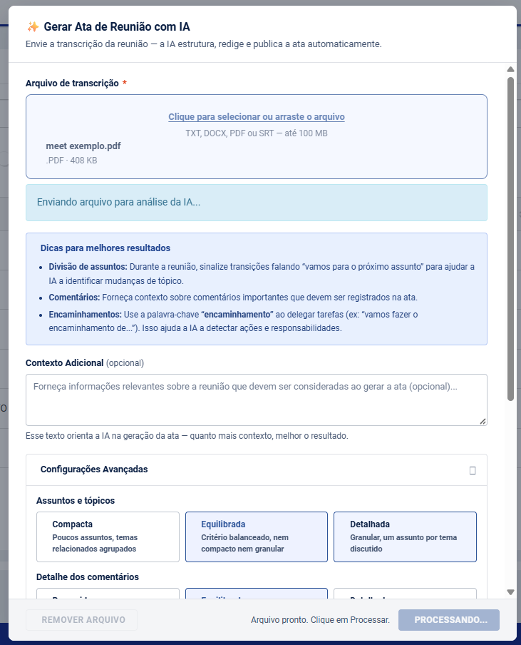
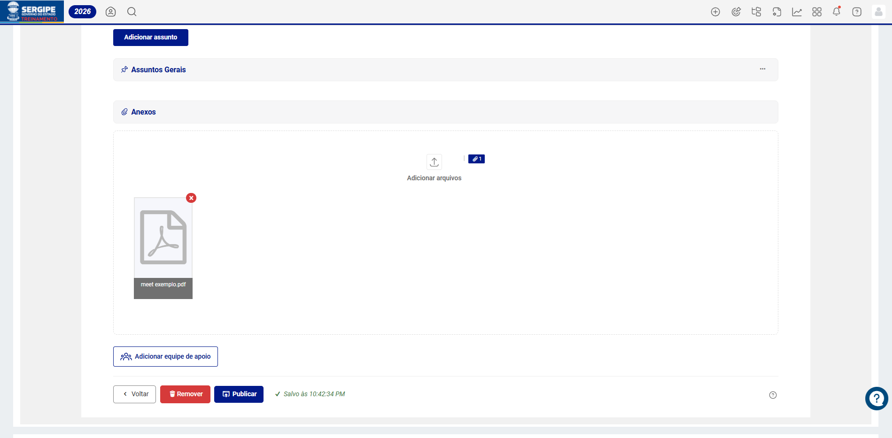

A funcionalidade **Gerar Ata com IA** permite transformar a transcrição de uma reunião em uma ata estruturada e publicada automaticamente, com o apoio de inteligência artificial. O sistema analisa o conteúdo enviado e organiza os assuntos, tópicos, comentários e encaminhamentos de forma padronizada, pronta para revisão e complemento pelo usuário.

O processo elimina a necessidade de redigir a ata manualmente a partir da gravação, reduzindo o tempo de elaboração de horas para minutos.

---

💡 <strong>Disponibilidade:</strong> Esta funcionalidade utiliza inteligência artificial. Verifique com o administrador se o recurso está habilitado para o seu ambiente. Limites de uso podem ser aplicáveis conforme a configuração da conta.

---

# Gerar Ata de Reunião com IA

## Como acessar

1. Acesse o módulo **Reuniões** pela barra de navegação.
2. Clique no botão **+ Criar** e selecione a opção **✨ Gerar ata com IA**.

---

## Passo a passo

### 1. Envie o arquivo de transcrição

No modal **Gerar Ata de Reunião com IA**, clique na área de upload ou arraste o arquivo diretamente para a tela.

- **Formatos aceitos:** TXT, DOCX, PDF e SRT (legendas)
- **Tamanho máximo:** 100 MB

**Dicas para melhores resultados:**

- Durante a reunião, sinalize as mudanças de assunto falando *"vamos para o próximo assunto"* — isso ajuda a IA a identificar as transições.
- Use a palavra **"encaminhamento"** ao delegar tarefas (*"vamos fazer o encaminhamento de..."*). Isso melhora significativamente a detecção automática de ações.

### 2. Adicione contexto (opcional)

O campo **Contexto Adicional** permite fornecer informações sobre a reunião que complementam a transcrição — como o objetivo da reunião, os participantes principais ou o projeto relacionado. Quanto mais contexto, mais preciso e personalizado será o resultado gerado.

### 3. Ajuste as configurações avançadas

Clique em **Configurações Avançadas** para personalizar a geração conforme o perfil da reunião:

**Assuntos e tópicos** — controla a granularidade da estrutura:

| Opção | Descrição |
|---|---|
| **Compacta** | Poucos assuntos; temas relacionados agrupados |
| **Equilibrada** *(padrão)* | Critério balanceado, nem compacto nem granular |
| **Detalhada** | Granular: um assunto por tema distinto discutido |

**Detalhe dos comentários** — define a profundidade textual de cada registro:

| Opção | Descrição |
|---|---|
| **Resumido** | Máximo 2 frases por assunto/tópico; foco no essencial |
| **Equilibrado** *(padrão)* | Captura o essencial sem excesso de detalhes |
| **Detalhado** | Descritivo e completo, com nuances e contexto |

**Linguagem** — define o registro formal do documento:

| Opção | Descrição |
|---|---|
| **Objetiva** | Direta e concisa; foco em fatos e decisões |
| **Profissional** *(padrão)* | Padrão corporativo e governamental |
| **Formal** | Elaborada; adequada para documentos oficiais |

**Anexar o arquivo original à ata após publicar** — quando ativado *(padrão)*, o arquivo de transcrição é automaticamente vinculado à ata como anexo após a publicação.

### 4. Processe a geração

Clique em **Processar**. A IA analisará o arquivo e gerará a ata automaticamente.

Ao concluir, a mensagem *"Ata publicada com sucesso!"* será exibida e o sistema redirecionará automaticamente para a **tela de edição**.

---

## Revisão da ata gerada

A ata é publicada com status **publicada, mas não finalizada**. Na tela de edição, você deverá:

- **Revisar o conteúdo gerado** — assuntos, tópicos e comentários criados pela IA devem ser conferidos e ajustados conforme necessário. Por se tratar de conteúdo gerado automaticamente, a validação humana é essencial.
- **Adicionar os participantes da reunião** — a IA não preenche a lista de participantes automaticamente. Esse campo deve ser preenchido manualmente na tela de edição.
- **Designar os responsáveis pelos encaminhamentos** — os encaminhamentos são detectados e criados pela IA, mas sem responsável atribuído. A designação deve ser feita manualmente para cada item.
- **Finalizar a ata** quando estiver pronta para registro oficial.

---

## Arquivo original como anexo

Quando a opção de anexo estiver ativa, o arquivo de transcrição enviado será vinculado automaticamente à ata na seção **Anexos**, mantendo o documento original acessível para referência futura.

---

## Conclusão

O **Gerador de Ata com IA** transforma a experiência de documentação de reuniões, eliminando o trabalho manual de redação e garantindo registros padronizados e organizados. A IA acelera o processo de criação, enquanto a revisão na tela de edição assegura que o documento final reflita com precisão as decisões e compromissos definidos na reunião.

> Atas bem elaboradas são fundamentais para o acompanhamento eficaz das deliberações e o controle dos encaminhamentos ao longo do tempo.

## Artigos Relacionados

- [Atas de Reunião](6.2_Atas_de_Reunião.md)
- [Vincular Encaminhamentos na Ata de Reunião](6.2.3_Vincular_Encaminhamentos_na_Ata_de_Reunião.md)
- [Encaminhamentos](6.3_Encaminhamentos.md)
