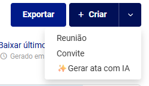
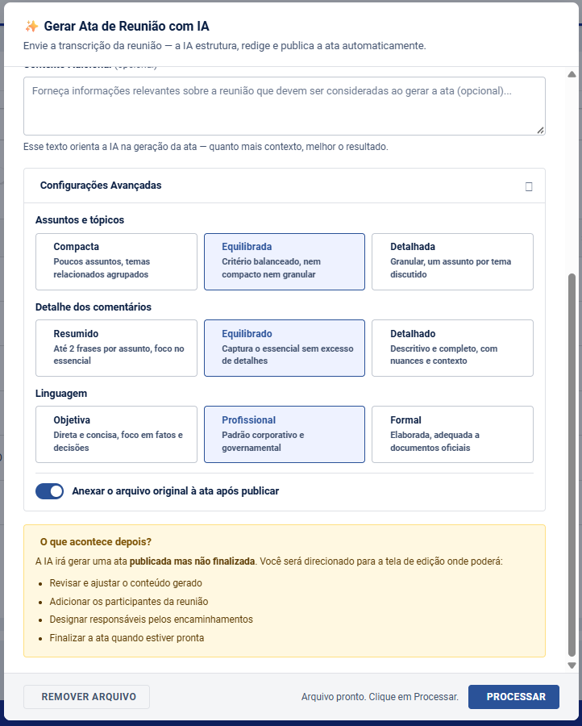
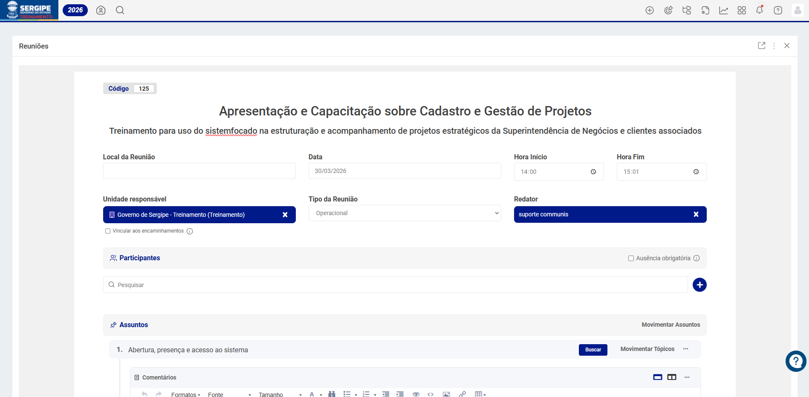

Redigir uma ata de reunião manualmente consome tempo precioso e exige concentração total após uma reunião já desgastante. Com o **Gerar Ata com IA**, esse trabalho é automatizado: basta enviar a transcrição ou a gravação de áudio da reunião e a inteligência artificial estrutura, redige e publica a ata com assuntos, tópicos, comentários e encaminhamentos organizados — tudo em minutos.

O resultado é um documento padronizado, completo e pronto para revisão, que garante rastreabilidade das decisões e agiliza o acompanhamento dos encaminhamentos definidos.

---

💡 <strong>Disponibilidade:</strong> Esta funcionalidade utiliza inteligência artificial. Verifique com o administrador se o recurso está habilitado para o seu ambiente. Limites de uso podem ser aplicáveis conforme a configuração da conta.

---

# Gerar Ata de Reunião com IA

## Como acessar

1. Acesse o módulo **Reuniões** pela barra de navegação.
2. Clique no botão **+ Criar** e selecione a opção **✨ Gerar ata com IA**.

---

## Passo a passo

### 1. Envie o arquivo de transcrição ou gravação

No modal **Gerar Ata de Reunião com IA**, clique na área de upload ou arraste o arquivo diretamente para a tela.

O sistema aceita dois tipos de entrada:

**Arquivos de transcrição (texto)**

| Formato | Descrição |
|---|---|
| **TXT** | Texto simples |
| **DOCX** | Documento Word |
| **PDF** | Documento PDF |
| **SRT** | Arquivo de legenda |

- Tamanho máximo: 100 MB

**Gravações de áudio**

| Formato | Descrição |
|---|---|
| **MP3** | Formato mais comum para gravações exportadas |
| **M4A** | Padrão de gravações do Teams, iPhone e macOS |
| **WAV** | Áudio sem compressão |
| **OGG / OPUS / FLAC** | Formatos alternativos |

- Tamanho máximo: 300 MB (equivalente a aproximadamente 2 horas de gravação)
- Arquivos acima de 24 MB são comprimidos automaticamente no navegador antes do envio, sem necessidade de ação do usuário

⚠️ <strong>Ao enviar um arquivo de áudio, não feche esta janela durante o processamento.</strong> O sistema primeiro transcreve o áudio automaticamente via IA e, em seguida, gera a ata. Esse processo pode levar de 1 a 3 minutos dependendo da duração da gravação. Um indicador de carregamento será exibido enquanto o processamento está em andamento.

**Dicas para melhores resultados:**

- Durante a reunião, sinalize as mudanças de assunto falando *"vamos para o próximo assunto"* — isso ajuda a IA a identificar as transições.
- Use a palavra **"encaminhamento"** ao delegar tarefas (*"vamos fazer o encaminhamento de..."*). Isso melhora significativamente a detecção automática de ações.
- Se a data da reunião não for mencionada claramente na gravação ou na transcrição, a ata será criada com a data do dia. Corrija a data na tela de edição, se necessário.

### 2. Adicione contexto (opcional)

O campo **Contexto Adicional** permite fornecer informações sobre a reunião que complementam a transcrição — como o objetivo da reunião, os participantes principais ou o projeto relacionado. Quanto mais contexto, mais preciso e personalizado será o resultado gerado.

### 3. Ajuste as configurações avançadas

Clique em **Configurações Avançadas** para personalizar a geração conforme o perfil da reunião:

**Assuntos e tópicos** — controla a granularidade da estrutura:

| Opção | Descrição |
|---|---|
| **Compacta** | Poucos assuntos; temas relacionados agrupados |
| **Equilibrada** *(padrão)* | Critério balanceado, nem compacto nem granular |
| **Detalhada** | Granular: um assunto por tema distinto discutido |

**Detalhe dos comentários** — define a profundidade textual de cada registro:

| Opção | Descrição |
|---|---|
| **Resumido** | Máximo 2 frases por assunto/tópico; foco no essencial |
| **Equilibrado** *(padrão)* | Captura o essencial sem excesso de detalhes |
| **Detalhado** | Descritivo e completo, com nuances e contexto |

**Linguagem** — define o registro formal do documento:

| Opção | Descrição |
|---|---|
| **Objetiva** | Direta e concisa; foco em fatos e decisões |
| **Profissional** *(padrão)* | Padrão corporativo e governamental |
| **Formal** | Elaborada; adequada para documentos oficiais |

**Anexar o arquivo original à ata após publicar** — quando ativado *(padrão)*, o arquivo enviado (transcrição ou gravação de áudio) é automaticamente vinculado à ata como anexo após a publicação.

### 4. Processe a geração

Clique em **Processar**. A IA analisará o arquivo e gerará a ata automaticamente.

- **Transcrição (texto):** o processamento costuma levar menos de 1 minuto.
- **Gravação de áudio:** o sistema transcreve o áudio primeiro e em seguida gera a ata. O tempo total pode variar de 1 a 3 minutos. Não feche a janela enquanto o indicador de carregamento estiver visível.

Ao concluir, a mensagem *"Ata publicada com sucesso!"* será exibida e o sistema redirecionará automaticamente para a **tela de edição**.

---

## Revisão da ata gerada

A ata é publicada com status **publicada, mas não finalizada**. Na tela de edição, você deverá:

- **Revisar o conteúdo gerado** — assuntos, tópicos e comentários criados pela IA devem ser conferidos e ajustados conforme necessário. Por se tratar de conteúdo gerado automaticamente, a validação humana é essencial.
- **Adicionar os participantes da reunião** — a IA não preenche a lista de participantes automaticamente. Esse campo deve ser preenchido manualmente na tela de edição.
- **Designar os responsáveis pelos encaminhamentos** — os encaminhamentos são detectados e criados pela IA, mas sem responsável atribuído. A designação deve ser feita manualmente para cada item.
- **Finalizar a ata** quando estiver pronta para registro oficial.

---

## Arquivo original como anexo

Quando a opção de anexo estiver ativa, o arquivo enviado — seja uma transcrição em texto ou uma gravação de áudio — será vinculado automaticamente à ata na seção **Anexos**, mantendo o documento original acessível para referência futura.

---

## Conclusão

O **Gerar Ata com IA** elimina o trabalho repetitivo de redigir atas, aceitando tanto transcrições em texto quanto gravações de áudio como ponto de partida. Independentemente do formato, a IA estrutura, redige e publica a ata de forma padronizada, completa e rastreável. Com a revisão na tela de edição, a agilidade da IA se combina com o controle humano necessário para um registro oficial preciso e confiável.

> Atas bem elaboradas são fundamentais para o acompanhamento eficaz das deliberações e o controle dos encaminhamentos ao longo do tempo.

## Artigos Relacionados

- [Atas de Reunião](6.2_Atas_de_Reunião.md)
- [Vincular Encaminhamentos na Ata de Reunião](6.2.3_Vincular_Encaminhamentos_na_Ata_de_Reunião.md)
- [Encaminhamentos](6.3_Encaminhamentos.md)
