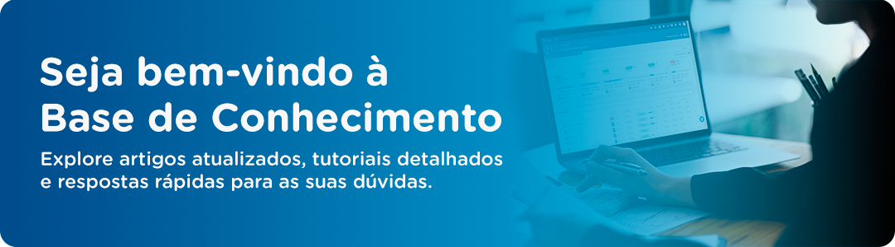

# Bem-vindo a documentação do Plataforma

Nossa base foi cuidadosamente desenvolvida para servir como uma fonte confiável de informações, destinada a auxiliá-lo na busca por respostas, na resolução de dúvidas sobre o produto e na configuração de recursos quando necessário. Além disso, ela é projetada para fornecer conhecimentos relevantes sobre o sistema, ajudando-o a aproveitar ao máximo nossa plataforma.

Estamos comprometidos em manter nossa base de conhecimento atualizada e abrangente, garantindo que você tenha acesso às informações mais recentes e precisas sempre que precisar. Se surgirem novas questões ou se você tiver sugestões para melhorias, não hesite em entrar em contato conosco. Estamos aqui para ajudar e tornar sua experiência com a Plataforma ainda mais produtiva e satisfatória.

Seja bem-vindo e aproveite ao máximo sua jornada de aprendizado e descoberta na Plataforma!

Para começar, selecione algum tópico no menu à esquerda.

!!! info "Sobre"
	Este espaço é mais do que uma simples fonte de informações - é uma comunidade onde compartilhamos conhecimento, experiências e insights para melhor atendê-lo. Valorizamos seu feedback e estamos sempre abertos a sugestões e comentários para aprimorar ainda mais nossa base de conhecimento e garantir sua satisfação contínua.

	Entre em contato:
	[atendimento@facilit.com.br](mailto:atendimento@facilit.com.br)

	Abra um chamado na: 
	[Central de Tickets](https://help.plataformatarget.com.br/Ticket)
